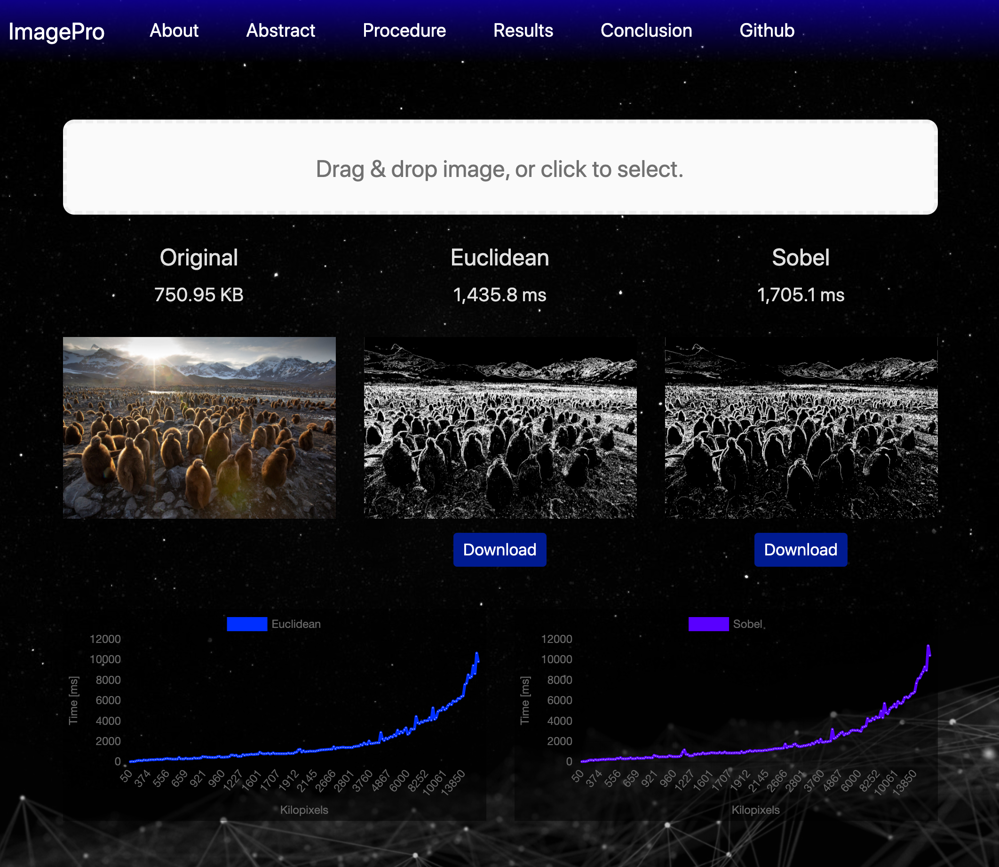
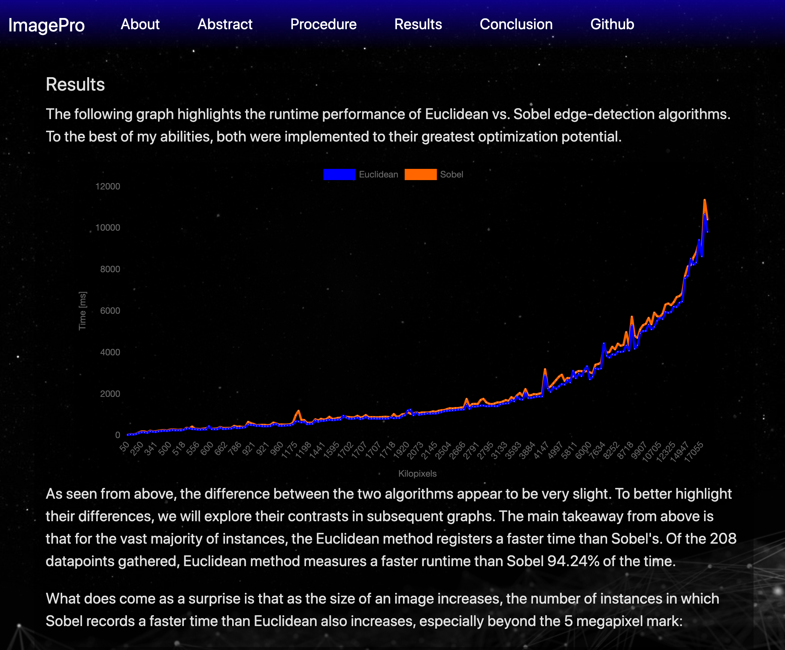

# ImagePro

Fullstack web app that detects edges in a jpeg file and conducts empirical analysis on 2 edge-detection algorithms: Euclidean & Sobel

Feel free to clone this repo and run the application locally.

<b>Requirements</b>
- Node JS version 13.12.0
- NPM version 6.14.4
- Mongo Key

<b>To Run</b>
- Open `MONGO_KEY.js` from the project directory and copy & paste Mongo Key value into the region labeled `PASTE MONGO KEY HERE` (the key has to be a string value so keep the single quotes around the key value) 
- `cd` into `frontend` directory and run `npm i`
- `cd` into `backend` directory and run `npm i`
- While in `backend` directory, run `npm start`
- Fire up a browser and go to `http://localhost:3000/`

Enjoy!

<b>Built with</b>  

      

<b>Screenshots</b>

